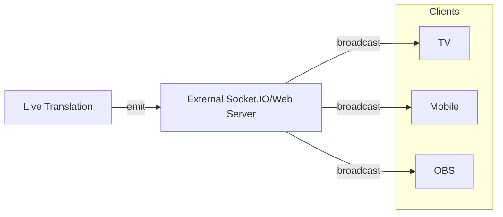

# Live Caption and Translation using Azure AI

This project is a simple implementation of live captioning and translation using Azure Cognitive Services. The project uses the Speech SDK to capture audio from the microphone, send it to the Azure Speech Service for live transcription and translation, and then display the transcribed and translated text in the browser.

This branch uses the external Socket.IO server and manages the multi-room functionality on Google Firebase.

Parts of the code are modified from [Sample Repository for the Microsoft Cognitive Services Speech SDK](https://github.com/Azure-Samples/cognitive-services-speech-sdk).

## Prerequisites

- Azure Speech Service subscription key and region
- Firebase Firestore (Firebase Hosting is optional)
- Node.js v22.0.0 or later
- Python 3.12 or later
- uv

## Features

- [x] Live captioning
- [x] Live translation
- [x] Auto-detect the speaker's language with continuous language identification
- [ ] OBS integration
- [x] Mobile mode
- [ ] TV mode

## Architecture



## Configuration

- Create a `.env` file in the root directory and add the following environment variables :

    ```bash
    AZURE_SPEECH_KEY=<YOUR_AZURE_SPEECH_KEY>
    AZURE_SPEECH_REGION=<YOUR_AZURE_SPEECH_REGION>
    ```

- Set up the Socket.IO server and add the server information to the `.env` file :

    ```bash
    SERVER_ID=<RANDOM_SERVER_ID>
    SOCKET_ENDPOINT=<YOUR_SOCKET_ENDPOINT>
    SOCKET_PATH=<YOUR_SOCKET_PATH>
    ```

- Download the Firebase Admin SDK credentials in json. You will pass this file by using the `--firebase-cred` argument.

## Usage

- Create Room on Firebase. This will guide you to enter the room information and create a room on Firebase :

    ```bash
    uv run --env-file=.env python main.py --firebase-cred firebase-cred.json --create-room
    ```

- Edit Room information on Firebase :

    ```bash
    uv run --env-file=.env python main.py --firebase-cred firebase-cred.json --roomid <ROOM_ID> --edit-room
    ```

- Start translation :

    ```bash
    uv run --env-file=.env python main.py --firebase-cred firebase-cred.json --roomid <ROOM_ID> 
    ```
