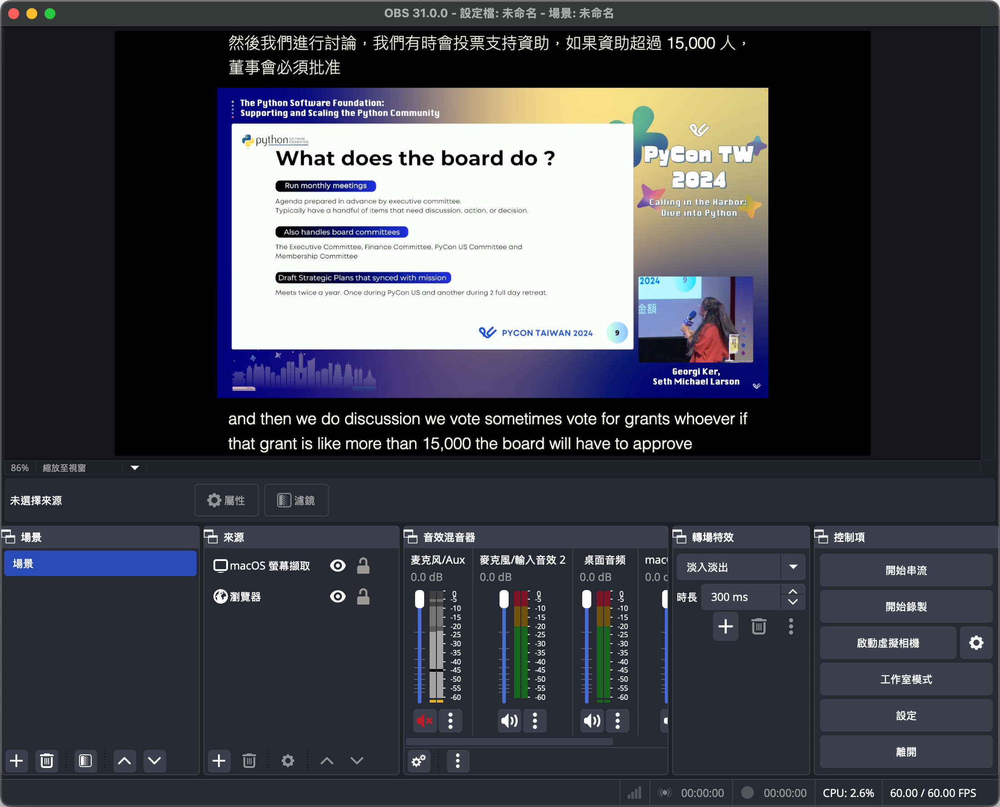
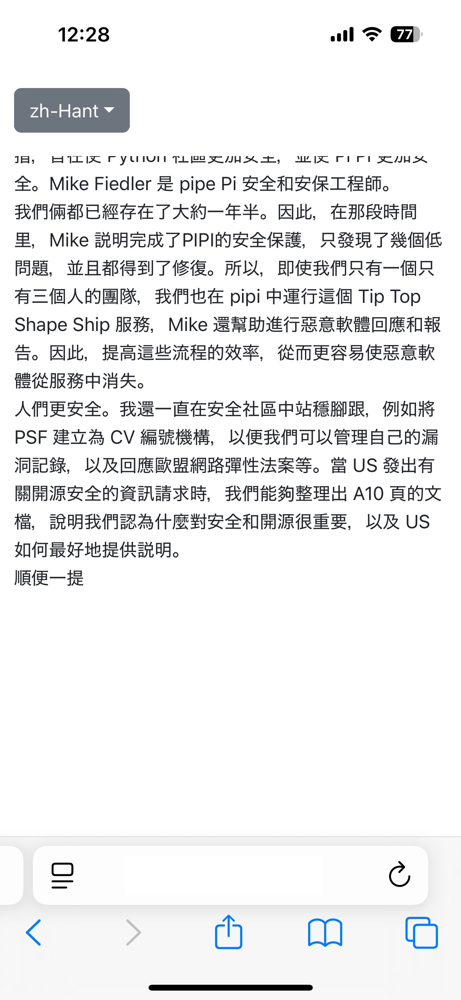
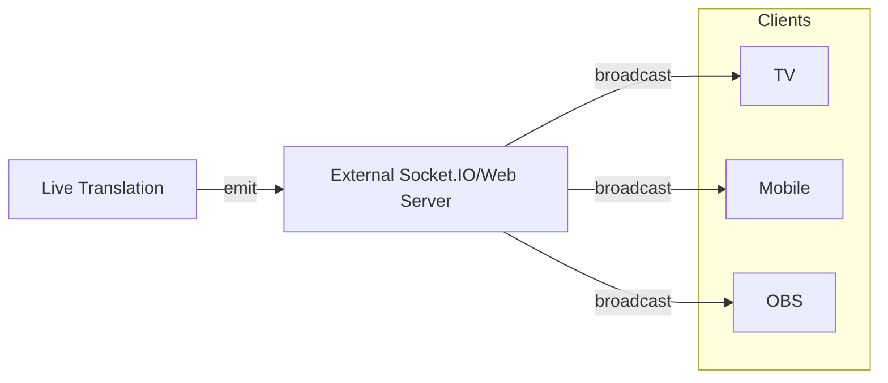

# Live Caption and Translation using Azure AI

This project is a simple implementation of live captioning and translation using Azure Cognitive Services. The project uses the Speech SDK to capture audio from the microphone, send it to the Azure Speech Service for live transcription and translation, and then display the transcribed and translated text in the browser.

Parts of the code are modified from [Sample Repository for the Microsoft Cognitive Services Speech SDK](https://github.com/Azure-Samples/cognitive-services-speech-sdk).

Demo Video:

https://github.com/user-attachments/assets/814a1731-2048-4bab-b0ea-68d10f935b2c


## Prerequisites

- Azure Speech Service subscription key and region
- Python 3.12 or later
- uv

## Features

- [x] Live captioning
- [x] Live translation
- [x] Auto-detect the speaker's language with continuous language identification
- [x] OBS integration
- [x] Mobile mode
- [x] TV mode

## Installation

1. Clone the repository

    For those who already know how to clone the repository, you can skip to the next step.

2. Install `uv`

    Use `uv` to setup the required version of Python.

    1. For MacOS / Linux users

        ```bash
        curl -LsSf https://astral.sh/uv/install.sh | sh
        ```

    2. For Windows users

        ```bash
        powershell -ExecutionPolicy ByPass -c "irm https://astral.sh/uv/install.ps1 | iex"
        ```

3. Setup Python and install dependencies

    ```bash
    uv sync
    ```

## Configuration

1. Set the Azure Speech Service subscription key and region in the `.env` file:

    ```bash
    AZURE_SPEECH_KEY =<your-subscription-key>
    AZURE_SPEECH_REGION =<your-region>
    ```

2. Set the list of candidate languages and target languages for translation in the `main.py` file:
    > Please note that the target language should be one of the supported languages by the Azure Speech Service. You can find the list of supported languages [here](https://docs.microsoft.com/en-us/azure/cognitive-services/speech-service/language-support).

    Note: If you want to transcribe speech only, set the target language to `[]`.

    ```python
    config = {
    ...
        "detect_languages": ["en-US", "zh-TW", "ja-JP"],
        "target_languages": ["zh-Hant", "en"],
    ...
    }
    ```

## Usage

### OBS Integration

Run the following command to start the application:

```bash
uv run --env-file=.env python main.py 
```

Then open the browser and go to `http://127.0.0.1:3000/` to see the live caption and translation. You can also open browser in brodcast application like OBS to show the live caption and translation in your live stream.

You can select languages by setting the query as `?language=original,en` in the URL. First language will be shown at bottom and second language will be shown at top.

Notice that the application will pick up the default microphone of your system.

Screenshot:


### Mobile Mode

You can also use the mobile mode by access `http://127.0.0.1:3000/mobile`. You can select the speaker's original language or the target language by clicking the dropdown on the top left corner.

<summary>Screenshot:</summary>


### TV Mode

You can also use the TV mode by access `http://127.0.0.1:3000/tv`. In this mode, the text will be displayed in a larger font size and the background will be black. All selected languages will be displayed in the same block.

You can select languages by setting the query as `?language=original,en` in the URL.

Screenshot:


## Adavanced Usage

You can run the application in client-server architecture. In this case, the server will be running on the local machine and the client will be hosted on the external server. The server will send the live caption and translation to the client using external Socket.IO.

### Architecture



### Usage

- Set the remote socket.io server endpoint and path in the `main.py` file and configure the  room id that will receive the caption and translation from the translation service:

    ```python
    config = {
    ...
        "socketio": {"endpoint": "http://127.0.0.1:3000", "path": "/socket.io"},
        "roomid": "9d2b8c9b-6ae9-45e9-81be-8f3d4d549fdd",
    ...
    }
    ```

- Build the client with the server URL and host it on the external server. Files will be generated in the `build` folder:

    ```bash
    uv run --env-file=.env python main.py --build
    ```

- Start the translation service without the server:

    ```bash
    uv run --env-file=.env python main.py --disbale-server
    ```
