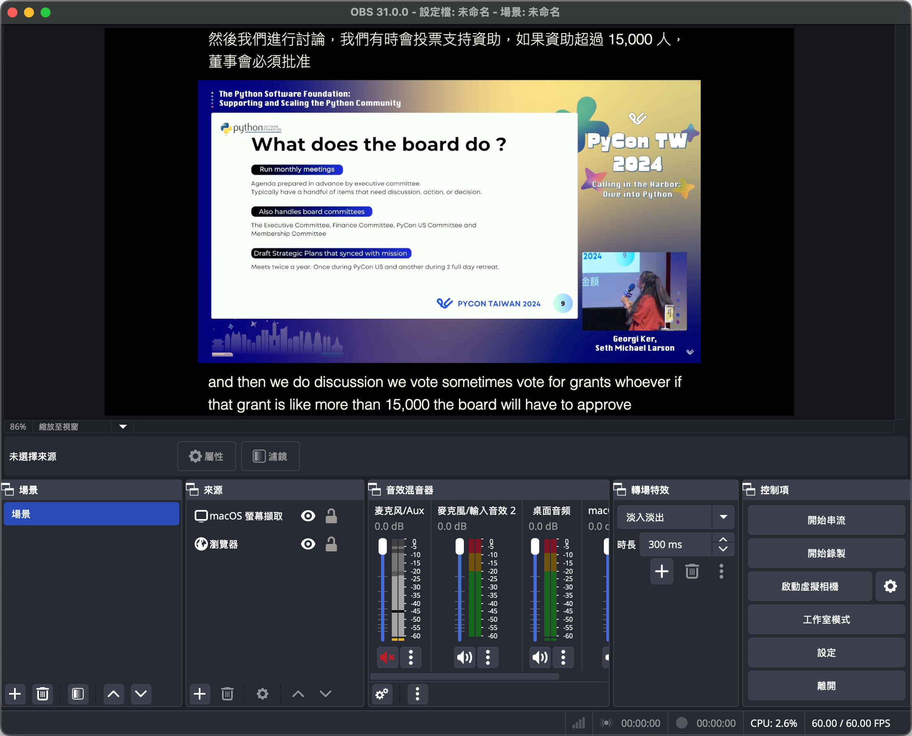

# Live Caption and Translation using Azure AI

This project is a simple implementation of live captioning and translation using Azure Cognitive Services. The project uses the Speech SDK to capture audio from the microphone, send it to the Azure Speech Service for live transcription and translation, and then display the transcribed and translated text in the browser.

Parts of the code are modified from [Sample Repository for the Microsoft Cognitive Services Speech SDK](https://github.com/Azure-Samples/cognitive-services-speech-sdk).

## Prerequisites

- Azure Speech Service subscription key and region
- Python 3.12 or later
- [uv]

## Features

- [x] Live captioning
- [x] Live translation
- [x] Auto detect speaker language
- [x] OBS integration
- [ ] Customizable UI
- [ ] TV/mobile mode

## Installation

1. Clone [live_translation]

    For those who already know how to clone the repository, you can skip to the next step.

2. [Install uv]

    Use [uv] to setup the required version of Python.

    1. For MacOS / Linux users

        ```bash
        curl -LsSf https://astral.sh/uv/install.sh | sh
        ```

    2. For Windows users

        ```bash
        powershell -ExecutionPolicy ByPass -c "irm https://astral.sh/uv/install.ps1 | iex"
        ```

3. Setup Python and install dependencies

    ```bash
    uv sync
    ```

## Configuration

1. Set the Azure Speech Service subscription key and region in the .env file:

    ```bash
    AZURE_SUBSCRIPTION_KEY=<your-subscription-key>
    AZURE_REGION=<your-region>
    ```

2. Set the target language for translation in the `main.py` file:
    > Please note that the target language should be one of the supported languages by the Azure Speech Service. You can find the list of supported languages [here](https://docs.microsoft.com/en-us/azure/cognitive-services/speech-service/language-support).

    Note: If you want to transcribe speech only, set the target language to `[]`.

    ```python
    config = {
    ...
        "detect_languages": ["en-US", "zh-TW", "ja-JP"],
        "target_languages": ["zh-Hant", "en"],
    ...
    }
    ```

3. If you want to use as client-server architecture, set the socketio server IP and port in the `main.py` file:

    ```python
    config = {
    ...
        "socketio": "http://127.0.0.1:3000/",
    ...
    }
    ```

## Usage

Run the following command to start the application:

```bash
uv run --env-file=.env python main.py 
```

Then open the browser and go to `http://127.0.0.1:3000/` to see the live caption and translation. You can also open browser in brodcast application like OBS to show the live caption and translation in your live stream.

You can switch the target language by setting the query like `?target=zh-Hant` in the URL. If you want to show only the translation, add another parameter `&translate_only` to the query.

Notice that the application will pick up the default microphone of your system.

Screenshot:

